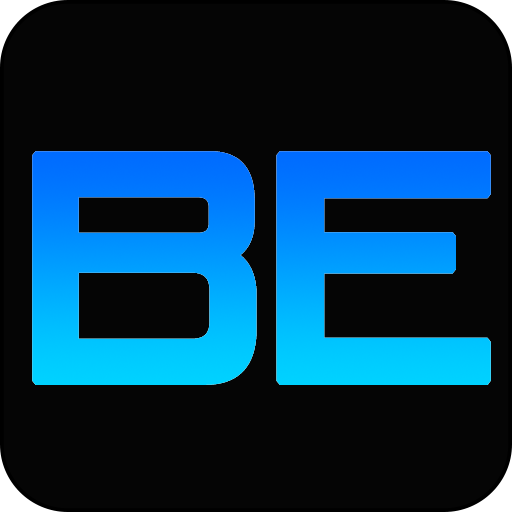
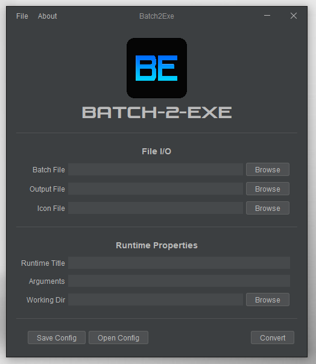

	

# Batch2Exe: Convert Batch File Into Windows Executable

Batch2Exe is a program for converting batch files to executable files on Windows. It has a user-friendly interface for inputting information and uses advanced compression and obfuscation techniques for security. This paper describes its technical aspects and features, making it a valuable tool for system administrators and developers.

	

## Requirements

- [Batch2Exe-GUI](./src/Batch2Exe-GUI): JDK 20, IntelliJ IDE
- [Batch2Exe-Wrapper](./src/Batch2Exe-Wrapper): .NET Framework 6.0, Visual Studio IDE
- [Batch2Exe-Launcher](./src/Batch2Exe-Launcher): MingW GCC
- [Batch2Exe-MSI](./src/Batch2Exe-MSI): WiX Toolset

## Build

Compile and build both [Batch2Exe-GUI](./src/Batch2Exe-GUI) and [Batch2Exe-Wrapper](./src/Batch2Exe-Wrapper), with their respective IDEs. Then run the [build.bat](./build/build.bat). If no error has been encountered, there will be a generated Microsoft installer on [dest](dest).

## Warning

After the MSI installation, on some systems it is required for the desktop shortcut (or even the application itself) to be ran as administrator.

## Developers

Leader:
- Isip, Nathanne

Members:
- Dela Pena, Jefford
- Evaristo, Argie
- Pago, Jhondel
- Reyes, Damiel

## License

Copyright © 2022

Permission is hereby granted, free of charge, to any person obtaining a copy of this software and associated documentation files (the “Software”), to deal in the Software without restriction, including without limitation the rights to use, copy, modify, merge, publish, distribute, sublicense, and/or sell copies of the Software, and to permit persons to whom the Software is furnished to do so, subject to the following conditions:

The above copyright notice and this permission notice shall be included in all copies or substantial portions of the Software.

THE SOFTWARE IS PROVIDED “AS IS”, WITHOUT WARRANTY OF ANY KIND, EXPRESS OR IMPLIED, INCLUDING BUT NOT LIMITED TO THE WARRANTIES OF MERCHANTABILITY, FITNESS FOR A PARTICULAR PURPOSE AND NONINFRINGEMENT. IN NO EVENT SHALL THE AUTHORS OR COPYRIGHT HOLDERS BE LIABLE FOR ANY CLAIM, DAMAGES OR OTHER LIABILITY, WHETHER IN AN ACTION OF CONTRACT, TORT OR OTHERWISE, ARISING FROM, OUT OF OR IN CONNECTION WITH THE SOFTWARE OR THE USE OR OTHER DEALINGS IN THE SOFTWARE.